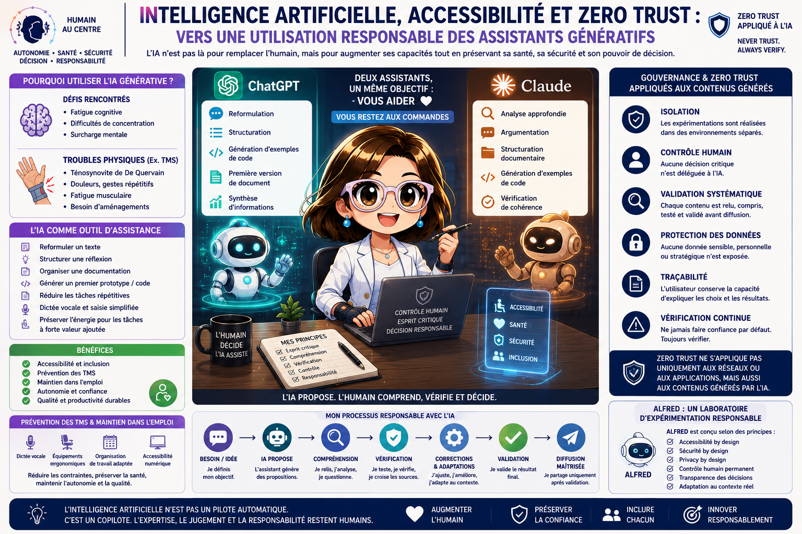

# Intelligence artificielle, accessibilité et Zero Trust : vers une utilisation responsable des assistants génératifs

> **Catégories** : Cybersécurité · RSE · Avancement du projet
> **Date** : 09 juin 2026
> **Auteur** : Cognitive Products Lab

---

---

## Introduction

L'intelligence artificielle générative est souvent présentée comme un levier de productivité capable d'automatiser certaines tâches intellectuelles. Les débats portent généralement sur les gains de temps, l'automatisation ou encore les impacts sur l'emploi.

Pourtant, un autre enjeu mérite une attention particulière : l'utilisation de ces technologies comme outil d'accessibilité, de compensation du handicap et de prévention des risques professionnels.

Chez Cognitive Products Lab, nous considérons que la valeur d'un système intelligent ne se mesure pas uniquement à sa capacité à produire du contenu ou du code, mais également à sa capacité à renforcer l'autonomie des utilisateurs tout en préservant leur santé, leur sécurité et leur pouvoir de décision.

Cette vision est au cœur des réflexions menées autour du projet ALFRED et plus largement de la conception de systèmes d'assistance intelligents centrés utilisateur.

---

## L'IA générative : un outil d'assistance avant d'être un outil de production

Les modèles génératifs sont capables de produire :

- du texte ;
- du code informatique ;
- des synthèses ;
- des analyses ;
- des documents structurés ;
- des supports de communication.

Cette capacité conduit parfois à une erreur d'interprétation : considérer l'IA comme un remplaçant de l'expertise humaine.

Or, un contenu généré n'est pas nécessairement un contenu exact.

Un code généré n'est pas nécessairement un code sécurisé.

Une réponse générée n'est pas nécessairement une réponse adaptée au contexte.

L'IA ne comprend pas les objectifs métiers, les contraintes réglementaires, les risques de sécurité ou les enjeux humains de la même manière qu'un professionnel expérimenté.

**Son rôle doit donc être considéré comme celui d'un assistant capable de proposer, et non de décider.**

---

## L'accessibilité : un enjeu souvent sous-estimé

Pour de nombreuses personnes, les assistants génératifs représentent bien plus qu'un simple gain de productivité.

Ils constituent un véritable outil de compensation.

Certaines situations peuvent rendre difficile l'exécution de tâches pourtant considérées comme simples :

- fatigue cognitive ;
- troubles de la concentration ;
- surcharge mentale ;
- troubles musculosquelettiques (TMS) ;
- limitations motrices ;
- douleurs chroniques.

Dans ces contextes, les outils d'assistance peuvent contribuer à :

- reformuler un texte ;
- structurer une réflexion ;
- organiser une documentation ;
- faciliter la rédaction ;
- générer un premier prototype ;
- réduire la quantité de saisie nécessaire.

L'objectif n'est pas de supprimer l'intervention humaine mais de réduire la charge associée aux tâches répétitives ou fortement consommatrices d'énergie.

---

## Prévention des TMS et maintien dans l'emploi

Les troubles musculosquelettiques représentent aujourd'hui la première cause de maladie professionnelle en France.

Selon l'INRS, les TMS représentent plus de **87 % des maladies professionnelles reconnues** et ont engendré plus de **10 millions de journées de travail perdues** en 2022. Leur coût humain et économique est considérable, tant pour les salariés que pour les entreprises.

Les métiers du numérique ne sont pas épargnés.

Saisie intensive, manipulation de souris, gestes répétitifs, utilisation prolongée des terminaux mobiles et maintien de postures statiques peuvent favoriser l'apparition de pathologies invalidantes.

Dans ce contexte, les outils d'assistance basés sur l'IA peuvent devenir un véritable levier de prévention.

Associés à :

- la dictée vocale ;
- des équipements ergonomiques ;
- des organisations de travail adaptées ;
- des solutions d'accessibilité numérique,

ils permettent de réduire certaines contraintes physiques tout en maintenant un niveau élevé de qualité et de productivité.

**L'intelligence artificielle devient alors un outil de maintien durable dans l'emploi.**

---

## Zero Trust appliqué à l'IA : ne jamais faire confiance, toujours vérifier

### Origine du principe

Le concept Zero Trust a été formalisé en 2010 par John Kindervag (Forrester Research) dans le domaine de la cybersécurité réseau. Face à l'inefficacité du modèle périmétrique classique — qui supposait que tout ce qui se trouvait à l'intérieur du réseau était fiable — il a posé un principe radicalement différent :

> **Never Trust. Always Verify. Assume Breach.**

Traduction : ne jamais faire confiance par défaut, vérifier en permanence, et partir du principe que la compromission est possible à tout moment.

Ce paradigme, initialement conçu pour les réseaux et les systèmes d'information, s'applique avec une pertinence remarquable aux outils d'intelligence artificielle générative.

---

### Pourquoi l'IA n'est pas fiable par défaut

Un système génératif n'est pas un expert. C'est un modèle statistique entraîné sur de grandes quantités de données textuelles. Il produit des réponses *vraisemblables*, pas nécessairement *vraies*.

Ses angles morts sont structurels :

- il ne connaît pas votre contexte métier précis ;
- il ne connaît pas vos contraintes réglementaires ou contractuelles ;
- il peut produire des informations factuellement incorrectes avec un niveau de confiance apparent élevé ;
- il peut générer du code fonctionnel mais vulnérable ;
- il n'a pas accès aux événements récents au-delà de sa date de coupure.

L'un des risques majeurs associés aux outils génératifs est précisément la **confiance excessive** accordée à leurs sorties. La fluidité du style et la cohérence apparente du contenu créent une illusion de fiabilité.

---

### Les quatre niveaux de vérification Zero Trust IA

Chez Cognitive Products Lab, nous appliquons un cadre de vérification à quatre niveaux pour toute utilisation d'un outil génératif :

**1. Vérifier le prompt**

La qualité de la sortie dépend directement de la qualité de l'entrée. Un prompt imprécis, ambigu ou mal contextualisé produira une réponse inadaptée. La vérification commence avant même d'envoyer la requête.

**2. Vérifier la sortie**

Chaque résultat doit être lu, compris et recoupé avec des sources indépendantes. Un contenu non relu est un contenu non validé. Un code non testé est un code non sécurisé.

**3. Vérifier le contexte d'usage**

Une réponse correcte dans un contexte donné peut être incorrecte ou dangereuse dans un autre. La validité d'une sortie est toujours relative à l'usage qui en est fait.

**4. Vérifier l'impact**

Avant diffusion ou déploiement : quelles sont les conséquences si cette information est fausse ? Si ce code contient une faille ? Si cette décision est mal fondée ? L'évaluation du risque résiduel est une étape non négociable.

---

### L'humain comme mécanisme d'authentification

Dans l'architecture Zero Trust réseau, chaque accès doit être authentifié, même depuis l'intérieur du périmètre. Dans l'architecture Zero Trust IA, **l'humain est le mécanisme d'authentification final**.

Aucune sortie ne doit être considérée comme validée tant qu'elle n'a pas été lue, comprise et approuvée par un professionnel responsable.

Ce principe n'est pas une limitation de l'IA — c'est une garantie de qualité et de responsabilité.

---

### Ce que cela change en pratique

| Sans Zero Trust IA | Avec Zero Trust IA |
|---|---|
| Copier-coller direct du contenu généré | Relecture, vérification, reformulation si nécessaire |
| Déployer du code généré sans test | Tests fonctionnels et de sécurité systématiques |
| Faire confiance à une réponse "convaincante" | Recouper avec des sources indépendantes |
| Diffuser sans valider les sources | Contrôle des sources avant toute publication |
| Déléguer une décision à l'IA | L'IA propose, l'humain décide |

---

## Une gouvernance de l'IA inspirée de la cybersécurité

L'utilisation responsable de l'IA repose sur plusieurs principes complémentaires au Zero Trust :

### Isolation

Les expérimentations doivent être réalisées dans des environnements séparés lorsque cela est possible. Aucune donnée sensible ne doit transiter par des outils non maîtrisés.

### Contrôle humain

Aucune décision critique ne doit être déléguée à un système génératif. L'IA formule une proposition — l'humain porte la responsabilité du choix final.

### Validation systématique

Chaque contenu doit être relu, compris et validé. La validation n'est pas optionnelle : elle est constitutive de l'usage responsable.

### Protection des données

Les données sensibles, personnelles ou stratégiques doivent faire l'objet d'une vigilance particulière. La règle par défaut : ne pas transmettre ce qu'on ne voudrait pas voir exposé.

### Traçabilité

L'utilisateur doit conserver la capacité d'expliquer les choix réalisés et les résultats obtenus. Une décision non traçable est une décision non défendable.

---

## Conclusion

L'intelligence artificielle générative ne doit pas être envisagée uniquement comme une technologie de productivité.

Elle représente également une opportunité majeure en matière :

- d'accessibilité ;
- d'inclusion ;
- de compensation du handicap ;
- de prévention des risques professionnels ;
- de maintien dans l'emploi.

Toutefois, ces bénéfices ne peuvent être obtenus que dans un cadre de gouvernance rigoureux.

**L'IA doit rester un copilote.**

L'humain demeure responsable de la compréhension, de la validation et de la décision.

Chez Cognitive Products Lab, nous sommes convaincus que l'avenir des assistants intelligents ne repose pas sur le remplacement de l'humain, mais sur leur capacité à augmenter ses possibilités tout en respectant sa santé, son autonomie et sa liberté de choix.

> L'innovation la plus utile n'est pas celle qui remplace l'humain.
>
> C'est celle qui lui permet de continuer à agir, créer, apprendre et décider malgré les contraintes qu'il rencontre.

---

## Pour aller plus loin

### Références réglementaires et normatives

| Référentiel | Description |
|---|---|
| [**EU AI Act**](https://eur-lex.europa.eu/legal-content/FR/TXT/?uri=CELEX:32024R1689) | Règlement européen sur l'intelligence artificielle (entré en vigueur août 2024). Encadre les systèmes d'IA selon leur niveau de risque. |
| [**RGAA 4.1**](https://accessibilite.numerique.gouv.fr/) | Référentiel Général d'Amélioration de l'Accessibilité — standard français pour l'accessibilité numérique. |
| [**WCAG 2.2**](https://www.w3.org/TR/WCAG22/) | Web Content Accessibility Guidelines — référentiel international d'accessibilité du W3C. |
| [**INRS — TMS**](https://www.inrs.fr/risques/tms.html) | Ressources de l'Institut National de Recherche et de Sécurité sur les troubles musculosquelettiques. |
| [**ISO 27001**](https://www.iso.org/fr/standard/27001) | Standard de management de la sécurité de l'information. |

### Ressources du projet ALFRED

- [Politique d'accessibilité ALFRED](../docs/gouvernance/accessibility_policy.md)
- [Blueprint gouvernance complet](../docs/gouvernance/blueprint_gouvernance_complet.md)
- [Roadmap du projet](../ROADMAP.md)
- [Règles Zero Trust ALFRED](../config/security/zero_trust_rules.json)

### Prochain article

**Zero Trust et IA générative : construire un cadre de confiance zéro pour les assistants intelligents**
*Publication prévue : semaine du 16 juin 2026*

---

## Illustration

*IA Générative : outil d'accessibilité, de prévention et d'innovation responsable — utilisée intelligemment, maîtrisée en permanence, contrôlée avant toute diffusion.*

---

## Synthèse visuelle

*Synthèse : accessibilité, gouvernance Zero Trust, prévention TMS et ALFRED comme laboratoire d'IA responsable. L'IA propose, l'humain comprend, vérifie et décide.*

---

## Rejoindre la conversation

Cet article vous a intéressé ? Vous souhaitez réagir, partager votre expérience ou poser une question ?

**Plusieurs façons de nous rejoindre :**

- **Laisser un commentaire** : rejoignez la discussion sur [GitHub Discussions](https://github.com/cognitive-products-lab/alfred_assistant/discussions) — un espace ouvert pour échanger sur le projet, les articles et les thématiques abordées.
- **Contribuer au projet** : le projet ALFRED est open source. Consultez le [guide de contribution](../CONTRIBUTING_FR.md) pour proposer des améliorations, signaler des problèmes ou partager vos idées.
- **Suivre les avancées** : [suivre le dépôt GitHub](https://github.com/cognitive-products-lab/alfred_assistant) pour être notifié des nouveaux articles, mises à jour et publications.
- **Contacter Cognitive Products Lab** : pour toute demande professionnelle, partenariat ou question spécifique, ouvrez une [issue GitHub](https://github.com/cognitive-products-lab/alfred_assistant/issues) ou contactez-nous directement via le profil de l'organisation.

> Chaque retour d'expérience enrichit le projet. Votre regard, qu'il soit technique, humain ou professionnel, a de la valeur.

---

*Article publié par Cognitive Products Lab — Projet ALFRED*
*Version 1.1 — Document évolutif, mis à jour selon les avancées du projet*
