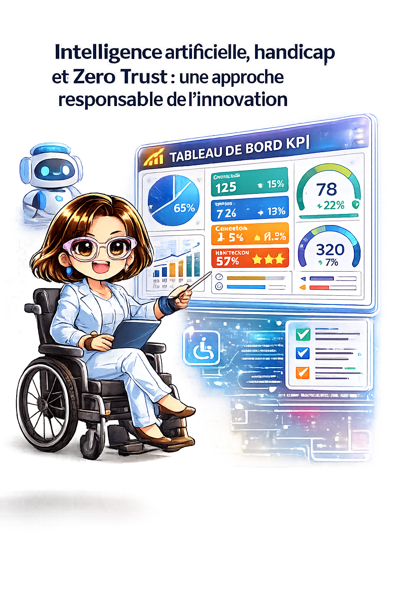
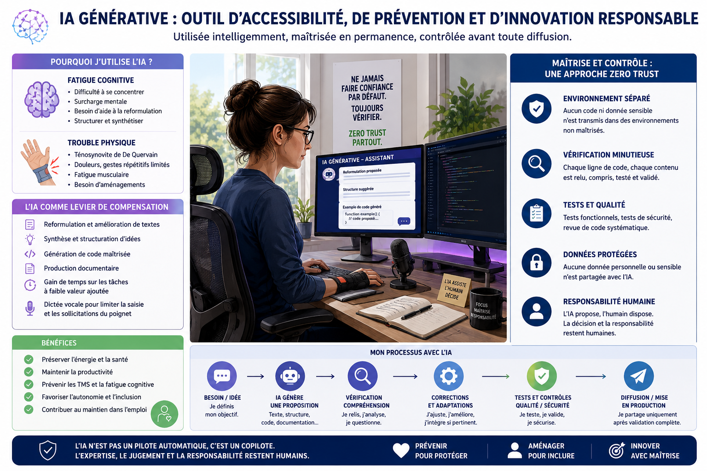

# Intelligence artificielle, accessibilité et Zero Trust : vers une utilisation responsable des assistants génératifs

> **Catégories** : Cybersécurité · RSE · Avancement du projet
> **Date** : 09 juin 2026
> **Auteur** : Cognitive Products Lab

---

---

## Introduction

L'intelligence artificielle générative est souvent présentée comme un levier de productivité capable d'automatiser certaines tâches intellectuelles. Les débats portent généralement sur les gains de temps, l'automatisation ou encore les impacts sur l'emploi.

Pourtant, un autre enjeu mérite une attention particulière : l'utilisation de ces technologies comme outil d'accessibilité, de compensation du handicap et de prévention des risques professionnels.

Chez Cognitive Products Lab, nous considérons que la valeur d'un système intelligent ne se mesure pas uniquement à sa capacité à produire du contenu ou du code, mais également à sa capacité à renforcer l'autonomie des utilisateurs tout en préservant leur santé, leur sécurité et leur pouvoir de décision.

Cette vision est au cœur des réflexions menées autour du projet ALFRED et plus largement de la conception de systèmes d'assistance intelligents centrés utilisateur.

---

## L'IA générative : un outil d'assistance avant d'être un outil de production

Les modèles génératifs sont capables de produire :

- du texte ;
- du code informatique ;
- des synthèses ;
- des analyses ;
- des documents structurés ;
- des supports de communication.

Cette capacité conduit parfois à une erreur d'interprétation : considérer l'IA comme un remplaçant de l'expertise humaine.

Or, un contenu généré n'est pas nécessairement un contenu exact.

Un code généré n'est pas nécessairement un code sécurisé.

Une réponse générée n'est pas nécessairement une réponse adaptée au contexte.

L'IA ne comprend pas les objectifs métiers, les contraintes réglementaires, les risques de sécurité ou les enjeux humains de la même manière qu'un professionnel expérimenté.

**Son rôle doit donc être considéré comme celui d'un assistant capable de proposer, et non de décider.**

---

## L'accessibilité : un enjeu souvent sous-estimé

Pour de nombreuses personnes, les assistants génératifs représentent bien plus qu'un simple gain de productivité.

Ils constituent un véritable outil de compensation.

Certaines situations peuvent rendre difficile l'exécution de tâches pourtant considérées comme simples :

- fatigue cognitive ;
- troubles de la concentration ;
- surcharge mentale ;
- troubles musculosquelettiques (TMS) ;
- limitations motrices ;
- douleurs chroniques.

Dans ces contextes, les outils d'assistance peuvent contribuer à :

- reformuler un texte ;
- structurer une réflexion ;
- organiser une documentation ;
- faciliter la rédaction ;
- générer un premier prototype ;
- réduire la quantité de saisie nécessaire.

L'objectif n'est pas de supprimer l'intervention humaine mais de réduire la charge associée aux tâches répétitives ou fortement consommatrices d'énergie.

---

## Prévention des TMS et maintien dans l'emploi

Les troubles musculosquelettiques représentent aujourd'hui la première cause de maladie professionnelle en France.

Les métiers du numérique ne sont pas épargnés.

Saisie intensive, manipulation de souris, gestes répétitifs, utilisation prolongée des terminaux mobiles et maintien de postures statiques peuvent favoriser l'apparition de pathologies invalidantes.

Dans ce contexte, les outils d'assistance basés sur l'IA peuvent devenir un véritable levier de prévention.

Associés à :

- la dictée vocale ;
- des équipements ergonomiques ;
- des organisations de travail adaptées ;
- des solutions d'accessibilité numérique,

ils permettent de réduire certaines contraintes physiques tout en maintenant un niveau élevé de qualité et de productivité.

**L'intelligence artificielle devient alors un outil de maintien durable dans l'emploi.**

---

## Le principe fondamental : l'IA n'est pas digne de confiance par défaut

L'un des risques majeurs associés aux outils génératifs est la confiance excessive accordée aux résultats produits.

Chez Cognitive Products Lab, nous défendons une approche inspirée des principes Zero Trust :

> **Never Trust. Always Verify.**

Autrement dit :

- ne jamais considérer un résultat comme fiable par défaut ;
- vérifier systématiquement les informations produites ;
- tester tout code généré ;
- contrôler les sources ;
- analyser les impacts de sécurité ;
- valider les résultats avant diffusion.

Cette approche est particulièrement importante lorsqu'il s'agit :

- de développement logiciel ;
- de cybersécurité ;
- de données personnelles ;
- de conformité réglementaire ;
- de prise de décision.

---

## Une gouvernance de l'IA inspirée de la cybersécurité

L'utilisation responsable de l'IA repose sur plusieurs principes simples :

### Isolation

Les expérimentations doivent être réalisées dans des environnements séparés lorsque cela est possible.

### Contrôle humain

Aucune décision critique ne doit être déléguée à un système génératif.

### Validation systématique

Chaque contenu doit être relu, compris et validé.

### Protection des données

Les données sensibles, personnelles ou stratégiques doivent faire l'objet d'une vigilance particulière.

### Traçabilité

L'utilisateur doit conserver la capacité d'expliquer les choix réalisés et les résultats obtenus.

---

## Conclusion

L'intelligence artificielle générative ne doit pas être envisagée uniquement comme une technologie de productivité.

Elle représente également une opportunité majeure en matière :

- d'accessibilité ;
- d'inclusion ;
- de compensation du handicap ;
- de prévention des risques professionnels ;
- de maintien dans l'emploi.

Toutefois, ces bénéfices ne peuvent être obtenus que dans un cadre de gouvernance rigoureux.

**L'IA doit rester un copilote.**

L'humain demeure responsable de la compréhension, de la validation et de la décision.

Chez Cognitive Products Lab, nous sommes convaincus que l'avenir des assistants intelligents ne repose pas sur le remplacement de l'humain, mais sur leur capacité à augmenter ses possibilités tout en respectant sa santé, son autonomie et sa liberté de choix.

> L'innovation la plus utile n'est pas celle qui remplace l'humain.
>
> C'est celle qui lui permet de continuer à agir, créer, apprendre et décider malgré les contraintes qu'il rencontre.

---

## Illustration

*IA Générative : outil d'accessibilité, de prévention et d'innovation responsable — utilisée intelligemment, maîtrisée en permanence, contrôlée avant toute diffusion.*

---

*Article publié par Cognitive Products Lab — Projet ALFRED*
*Document évolutif — mis à jour selon les avancées du projet*
